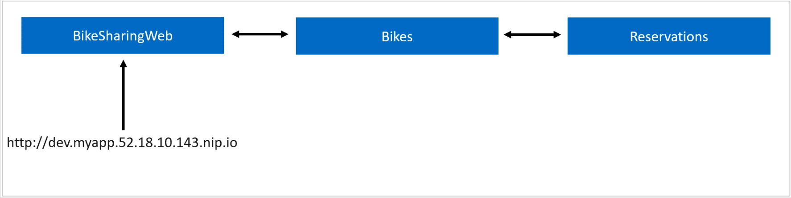
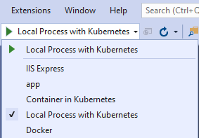

Debugging Kubernetes with Azure Dev Spaces
==========================================

This is the companion code to https://robrich.org/slides/debug-kubernetes-devspaces/#/

Want to debug a microservice running in Kubernetes without running all the services locally too?




Run Locally Without Containers
------------------------------

1. Debug the `backend` solution in Visual Studio.

2. Startup `middletier` in VS Code:

   ```
   cd middletier
   npm install
   npm run start
   ```

3. Debug `frontend` solution in Visual Studio.

4. Browse to http://localhost:5000/


Run in Docker locally
---------------------

This builds and runs all 3 containers locally inside Docker (not Kubernetes).

1. Start it up:

   ```
   docker-compose build
   docker-compose up
   ```

2. Browse to http://localhost:5000/

4. When you're done, stop things:

   ```
   cntrl-c
   docker-compose down
   ```


Run in Kubernetes locally
-------------------------

1. Build containers:

   ```
   cd frontend
   docker build -t frontend:v0.1 .
   cd ../middletier
   docker build -t middletier:v0.1 .
   cd ../backend
   docker build -t backend:v0.1 .
   cd ..
   ```

2. Start everything in Kubernetes:

   ```
   kubectl apply -f k8s/backend.yaml
   kubectl apply -f k8s/middletier.yaml
   kubectl apply -f k8s/frontend.yaml
   ```

   Applying them in this order ensures the services exist before the pods that will use them, ensuring the DNS entries exist by the time the pod launches.

3. Get status and launch browser:

   ```
   kubectl get all,ing
   ```

   If ingress is not configured on your local kubernetes cluster, browse to the 30000's port for the frontend service.  If ingress is configured, you may need to add hosts file entries to `frontend.docker.internal`.

4. When you're done, stop things:

   ```
   kubectl delete -f k8s
   ```


Run on Azure
------------

1. Create an Azure Kubernetes Service (AKS) and an Azure Container Registry (ACR).  In AKS, turn on [HTTP Application Routing](https://docs.microsoft.com/en-us/azure/aks/http-application-routing).

2. Adjust k8s files:

   Inside the `k8s` folder, adjust all the entries referencing `ACRURL` and `AKSURL` to match ACR's `Login server` and AKS's `API server address` respectively.

3. Build containers:

   ```
   cd frontend
   docker build -t frontend:v0.1 .
   cd ../middletier
   docker build -t middletier:v0.1 .
   cd ../backend
   docker build -t backend:v0.1 .
   cd ..
   ```

4. Switch context to AKS cluster:

   a. [Get the credentials to the cluster](https://docs.microsoft.com/en-us/cli/azure/aks?view=azure-cli-latest#az-aks-get-credentials)

   b. Switch contexts

      ```
      kubectl config get-contexts
      kubectl config use-context <your_aks_name>
      ```

5. Start everything in Kubernetes:

   ```
   kubectl apply -f k8s/backend.yaml
   kubectl apply -f k8s/middletier.yaml
   kubectl apply -f k8s/frontend.yaml
   ```

   Applying them in this order ensures the services exist before the pods that will use them, ensuring the DNS entries exist by the time the pod launches.

6. Get status and launch browser:

   ```
   kubectl get all,ing
   ```

   It may take some time for the ingress address to appear and the new DNS entries to propigate.  Until then, you can proxy into the frontend service: `kubectl port-forward service/frontend 5000:80` and browse to http://localhost:5000/.

   Once everything is ready, launch the browser to http://frontend.AKSURL swapping in your AKSURL as we did above.

7. When you're done, stop things:

   ```
   kubectl delete -f k8s
   ```


Debug C# Projects Locally with Kubernetes
-----------------------------------------

1. Install [Visual Studio prerequisites](https://docs.microsoft.com/en-us/visualstudio/containers/local-process-kubernetes?view=vs-2019#prerequisites).

2. Run all content in AKS (see above).

3. Open `backend` or `frontend` in Visual Studio 2019 16.7 or better.

4. Set some breakpoints in interesting code such as the HomeController.

5. In the Debug menu choose Local Process with Kubernetes.

   

6. Click the green play button.

   The first time you run, it'll prompt you to choose the Azure subscription, AKS cluster, k8s namespace, and service to debug.  Chose the service that matches the project you're running.

   It'll prompt you for admin access to update your hosts file and launch kubectl proxy commands.  See https://docs.microsoft.com/en-us/visualstudio/containers/overview-local-process-kubernetes?#using-local-process-with-kubernetes

7. Launch the public url in AKS for the frontend service: http://frontend.AKSURL swapping in your AKSURL url.

8. It'll hit your breakpoint.

Once you stop debugging, it'll automatically detach the debugger and put the original service back into place.


Debug Node Projects Locally with Kubernetes
-------------------------------------------

1. Install [VS Code prerequisites](https://code.visualstudio.com/docs/containers/local-process-kubernetes#_prerequisites).

2. Run all content in AKS (see above) and switch kubectl contexts (see above).

3. Open `middletier` in VS Code.

4. Set some breakpoints in interesting code such as routes/index.js or lib/shoot.js.

5. Configure the link to AKS:

   - Hit cntrl+shift+p

   - Choose `Local Process with Kubernetes: Configure Local Process with Kubernetes`

   - Choose the `middletier` service, and forward to port 3000.

6. Switch to the Debug tab, and launch `debug with aks`.

   It'll prompt you for admin access to update your hosts file and launch kubectl proxy commands.  See https://docs.microsoft.com/en-us/visualstudio/containers/overview-local-process-kubernetes?#using-local-process-with-kubernetes

7. Launch the public url in AKS for the frontend service: http://frontend.AKSURL swapping in your AKSURL url.

8. It'll hit your breakpoint.

Once you stop debugging, it'll automatically detach the debugger and put the original service back into place.


License
-------

MIT, Copyright Richardson & Sons, LLC
